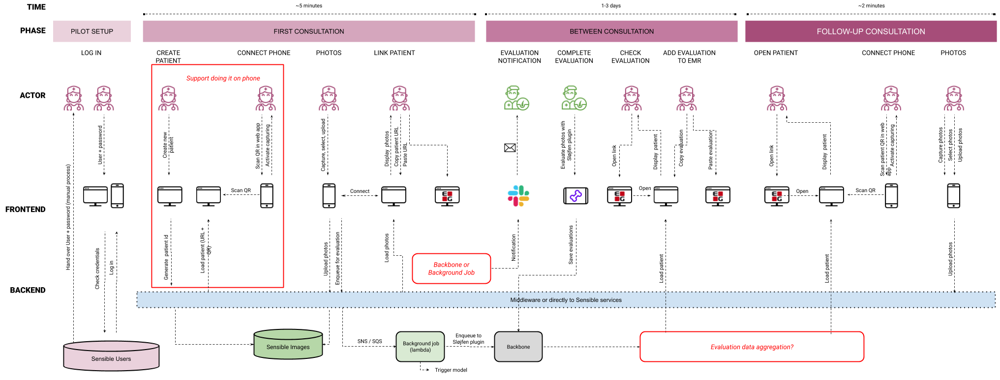
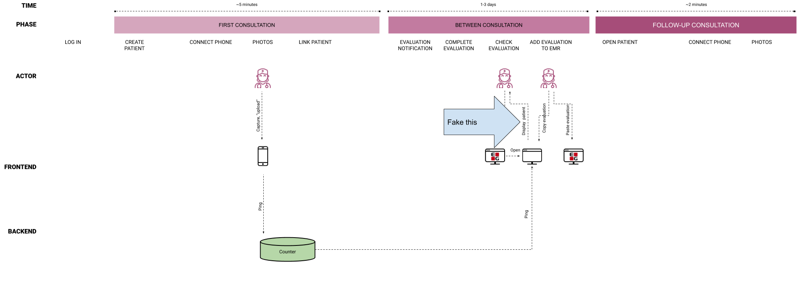
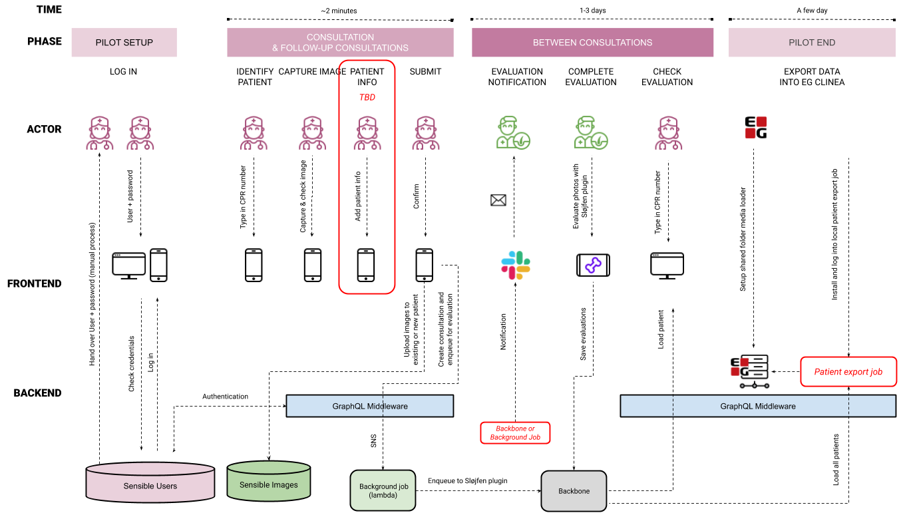

import { Appear, Image, Notes } from '@mdx-deck/components'
import BlurryImage from './components/blurryImage'
export { default as themes } from './components/theme'

# UX programming

## Prototyping in code

<Notes>
  Before we start: We'll share a link to this presentation and any service, app,
  website etc. I mention are on the last slides. I really wanted to do a
  workshop but since we are this many I had to do a demo approach instead.
</Notes>

---

# Andreas Larsen

## UX/UI engineer, former med. student & ICU nurse

## [larsenwork.com](https://larsenwork.com)

<Notes>My name is.</Notes>

---

<BlurryImage src="./images/students.gif" />

<Notes>
  Code can be a bit magic/confushing but please interupt me, ask me afterwards
  or send me a message. All code samples are shared too, obviously.
</Notes>

---

<BlurryImage src="./images/rhino.gif" />

<Notes>
  I know this talk could fill you with this feeling which I think we all with
  tech. With the underlying question being...
</Notes>

---

# Do I, UXer, need to code?

<Appear>

## No

## But understand when to use that skill within our teams.

</Appear>

<Notes>I know this is beating a dead horse and no...</Notes>

---

# Coding, when?

<Appear>

## Most likely earlier in the process than you are doing today.

## At least if you have the freedom to explore

## Freedom to innovate

</Appear>

<Notes>
  Early (it's not only the final product)...Freedom: if you sit in an agency
  this might not be the case.
</Notes>

---

# Coding, why?

<Appear>

## Because design artefacts are:

### Limiting

### Decoupled from your data + tech. stack

</Appear>

<Notes>
  Design artefacts (Sketch, Figma creations etc.)... Limiting (Live camera) Data
  (You might have an API or Machine learning model that is already quite
  capable). Tech (You might already have a rich plug and play component library
  in code).
</Notes>

---

# Coding, why?

## It's often quicker

<Appear>

## It's more realistic

</Appear>
<Notes>
  If you work with data, sensors etc.
</Notes>

---

# Case

## Cross device picture taking flow

<Notes>
  We are working with a clinic where we want them to take pictures on the phone
  and get the results on their main device (desktop). They actually already have
  a camera but never use it because it adds no value and process is too manual.
</Notes>

---

<Notes>
  The solution we came up with after inital talks with the clinic was this UX
  blueprint. Obviously we wanted to test this and couldn't do it in e.g. Figma
  so we turned to code.
</Notes>

---

# You ~~code~~ can still fake it

<Appear>

## ÷backend, ÷live dermatologist involved, ÷machine learning model, ÷production ready code

## simple camera app → ping a server → show "result" on website

</Appear>

<Notes>...No authentication, no transfer/storing of image, so</Notes>

---

<Notes>We went from this to only testing...</Notes>

---

<Notes>
  This. It was critical for us to test: how a HCP takes pictures, how it works
  to switch between devices, how it integrates with their journaling system.
</Notes>

---

<BlurryImage src="./images/cat.gif" />

<Notes>Demo time, cphux.surge.sh</Notes>

---

<BlurryImage src="./images/thumbs.gif" />

<Notes>Hopefully it looked easy (you should never do live demos)</Notes>

---

<Notes>So based on our tests we went from this</Notes>

---

<Notes>
  To this. Because a full stack developer was part of the testing he asked a why
  not use CPR number. We hadn't because we thought GDPR and also didn't knew our
  database supported it.
</Notes>

---

# Remote testing

Dermatologists in 🇷🇴 - <a href="https://backbone-final.surge.sh" target="_blank">Surge website</a>

Testing UI itterations

<Notes>
  Some of our team members are dermatologists in Romania that have an interface
  we use for machine learning model training. They aren't that tech savy so
  sharing a link on Slack they can open which just works like the normal website
  for testing UI itterations is way easier.
</Notes>

---

# Codesign

Momondo colors <a href="https://codepen.io/larsenwork/pen/wJoMqm?editors=0110" target="_blank">CodePen</a>

---

# Takeaways, coding is

<Appear>

## Easy and fun!

## Not (only) the final step

## Pivotal for innovation, especially in the design+research phase

</Appear>

---

# Links

## Services

- [Surge](https://surge.sh/)&nbsp;Instant publish static websites
- [CodePen](https://codepen.io/)&nbsp;Quick code mockups
- [CodeSandbox](https://codesandbox.io/)&nbsp;Online web apps

---

# Links

## Technologies

- [HTML](https://developer.mozilla.org/en-US/docs/Learn/Getting_started_with_the_web/HTML_basics), [CSS](https://developer.mozilla.org/en-US/docs/Learn/CSS), [JS](https://developer.mozilla.org/en-US/docs/Learn/JavaScript/First_steps/A_first_splash)&nbsp;Tutorials on MDN
- [JSON](https://developer.mozilla.org/en-US/docs/Learn/JavaScript/Objects/JSON)&nbsp;Working with JSON
- [Material-UI](https://material-ui.com/)+[Vuetify](https://vuetifyjs.com)&nbsp;Material Design React + Vue components

---

# Links

## Related to this talk

- [This presentation (code)](https://github.com/larsenwork/talks-demo-resources/blob/master/presentations/deck.mdx)
- [Code examples in this demo](https://github.com/larsenwork/talks-demo-resources/tree/master/2019-04-25%20CHPUX)
- [GDPR Sensitive data](https://ec.europa.eu/info/law/law-topic/data-protection/reform/rules-business-and-organisations/legal-grounds-processing-data/sensitive-data/what-personal-data-considered-sensitive_en)

---

# 🙏 cphux.surge.sh
